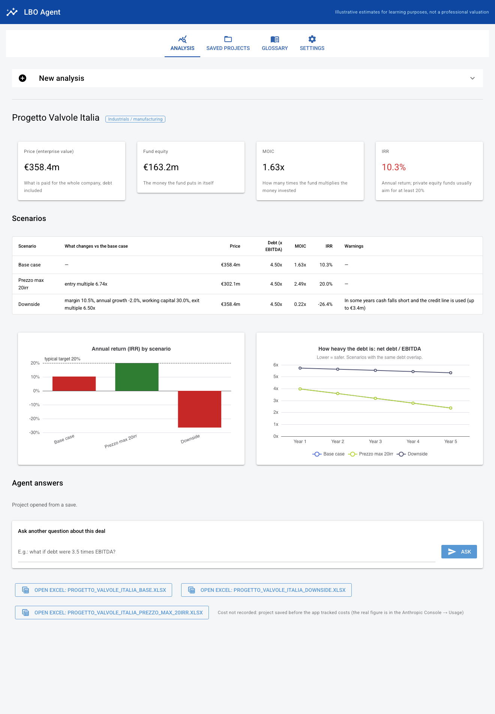
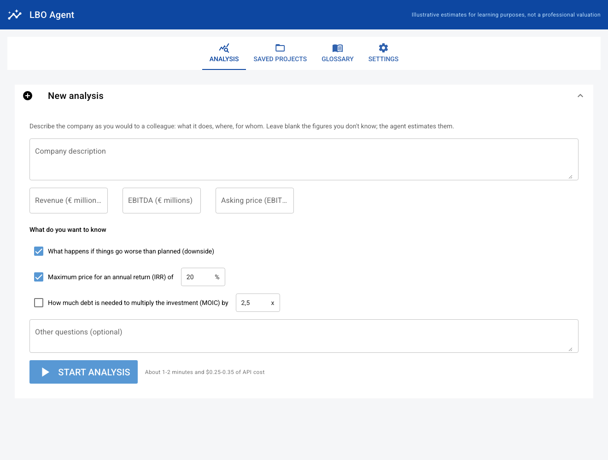

# LBO AI Agent

An AI agent for **leveraged buyout (LBO) analysis**. Describe a company in plain words; the agent estimates the deal assumptions under sector guardrails, runs them through a **tested, deterministic LBO engine** (fees and OID, a year-by-year operating plan, maintenance covenants, optional average-balance interest), builds and compares scenarios, answers investment-committee questions, and exports a **live-formula Excel model**. A bilingual (IT/EN) desktop app puts it in front of non-experts.

> **Principle: the AI judges, the code computes.** Every figure in the agent's answer comes from a deterministic tool. The evaluation suite measures this: 98% of the numbers in answers trace back to tool outputs, and all 15 live test cases pass.



*Illustrative estimates for learning purposes, not a professional valuation.*

---

## What it does

Ask, for example: *"Italian industrial-valve maker, €320m revenue, oil & gas and utilities clients, 4 plants. What is the maximum multiple for a 20% IRR? What does the downside look like?"* The agent:

1. **Builds a base case.** Claude proposes the model inputs via structured output (including a year-by-year plan and covenants when the description implies them); each is tagged *provided* (stated in the text) or *estimated*, with a rationale. Deterministic guardrails then:
   - clamp estimates to sector ranges;
   - flag user figures that fall outside them (never change them);
   - enforce no multiple expansion, at least 30% equity and sub debt priced at least 150 bps over senior.
2. **Runs the LBO engine:** S&U with fees and OID, operating projection, cash waterfall, 3-tranche debt schedule, covenant tests with step-downs, returns.
3. **Answers threshold questions numerically.** `solve_for_target` finds the entry multiple, leverage, exit multiple, growth or margin that hits a target IRR/MOIC (grid search plus bisection on the engine).
4. **Stress-tests post-closing.** The downside keeps price and debt as signed while the operating plan disappoints, and reports the first covenant breach and the EBITDA headroom. A pre-signing "re-price" view is an explicit option.
5. **Exports Excel** and writes an IC-style answer: deal snapshot, returns by scenario, what the guardrails changed, key risks.

Example output (the valve maker above):

| Scenario | Entry | MOIC | IRR |
|---|---|---|---|
| Base case | 8.0x (EV €358m) | 1.63x | 10.3% |
| Max price for 20% IRR | **6.74x** (EV €302m) | 2.49x | 20.0% |
| Post-closing downside (revenue −2%/yr, margin 10.5%, exit 6.5x) | 8.0x | 0.22x | −26.4% |

Buying at 8.0x would need **7.1x leverage** to reach 20%, with equity at 12.5% and 1.90x interest cover. The agent tested this and rejected it: the price, not the debt, has to move.

---

## Components

| Module | Role |
|---|---|
| `lbo_engine.py` | Deterministic LBO engine: S&U with transaction fees, financing fees and OID, year-by-year plan, waterfall (mandatory amortisation → RCF → cash sweep → retained cash), Term Loan / Sub Notes / RCF, covenant tests, optional average-balance interest, exit, MOIC and IRR |
| `assumption_generator.py` | Claude structured output → guardrails → `Assumptions` plus a field-by-field audit trail |
| `sector_benchmarks.py`, `data/sector_benchmarks.json` | 14 sector ranges: hand-set, partly calibrated on public and Capital IQ data, with sources |
| `calibrate_benchmarks.py`, `import_capiq.py` | Calibration from Damodaran Europe data, Capital IQ screening exports, or your own comparables CSV (true P25–P75) |
| `excel_export.py` | Live-formula workbook: Assumptions, Plan (year-by-year drivers), LBO (S&U, IS, FCF, waterfall, debt schedule, credit stats, covenant tests, checks, returns, IRR sensitivity), Audit; circularity switch for average-balance interest |
| `lbo_agent.py` | Tool-use agent (Anthropic tool runner), deal persistence (save/reload, Q&A history, API cost), CLI |
| `app.py`, `app_logic.py` | Desktop app (NiceGUI + pywebview): guided form, plain-language progress, KPI cards, scenario table, charts, saved projects, glossary, IT/EN, API key in the macOS Keychain |
| `evals/` | 15-case evaluation suite against the real API, with [results](evals/RESULTS.md) |
| `tests/` | 234 automated tests |

## Modelling conventions

- **Interest:** on opening balances by default. An average-balance switch, as on most desks, is solved by fixed-point iteration in Python and by iterative calculation in Excel, with an `IFERROR` circuit breaker so the workbook never opens on `#VALUE!`.
- **Fees:** transaction fees and financing fees (% of debt) plus senior OID are Uses; financing fees and OID are amortised over the debt tenor, non-cash and tax-deductible.
- **Operating plan:** growth, margin and capex can be set year by year (the last value repeats); a flat value applies otherwise.
- **Covenants:** maximum net leverage with annual step-downs and minimum interest cover, tested every year, with the EBITDA headroom. When not given, they are set as a lender would, at ~30% EBITDA headroom to the base case.
- **Cash waterfall:**
  1. FCF plus surplus cash;
  2. Term Loan mandatory amortisation (% of original principal);
  3. a shortfall is drawn on the RCF; a surplus repays the RCF, then sweeps the Term Loan;
  4. anything left is retained.
- **Sub Notes** are bullet and non-call.
- **Entry terms vs operating plan:** LTM EBITDA at closing sizes price and debt; the projected margin drives years 1..N.
- **IRR** = MOIC^(1/years) − 1, since there are only two equity cash flows. Tests cross-check it against `numpy_financial.irr`.
- **Not modelled:** covenant waivers and refinancing (a breach is reported, not resolved), tax-loss carry-forwards, dividend recaps, management equity, sub-annual periods.

## How it is verified

- **Engine (78 tests):**
  - cash conservation every year across 6 scenarios covering every branch of the waterfall (Δ net debt = FCF);
  - regression to the original engine;
  - fees, year-by-year plans, covenant step-downs and the circularity solver, each against hand calculations;
  - a year-1 hand calculation;
  - input validation.
- **Two bugs found in my original v1 engine** (`lbo_engine_v1_original.py`), both fixed:
  - surplus cash was dropped once the Term Loan was repaid: €459m vanished in a 7-year low-leverage case, and IRR read 9.6% instead of 13.2%;
  - cash shortfalls were funded from nothing: IRR read 12.4% instead of 8.9%.
- **Excel (25 tests):** the workbook is a second implementation of the engine.
  - It is evaluated with `pycel` and matched **line by line, year by year** against Python.
  - Editing an input cell reprices exactly like the engine.
  - All 25 sensitivity cells match.
  - No hard-coded numbers on the model sheet.
  - It was also recalculated in Microsoft Excel, including the circular version (same MOIC and IRR as Python on first open).
- **Agent (27 + 12 tests):** the full tool loop is tested offline through the real SDK with scripted API responses. Covered: tool errors fed back to the model, follow-ups, refusals, save/reload.
- **Live evaluation (15 cases, real API):** programmatic checks cover:
  - the right sector;
  - user figures kept;
  - expected tool calls (e.g. `solve_for_target` for "max price for 20% IRR");
  - year-by-year plans and stated covenants captured;
  - a correct post-closing downside;
  - guardrail flags where expected;
  - the Excel export;
  - the answer language;
  - **grounding**, the share of answer figures traceable to tool outputs.

  Latest run (26 Sep 2026): **15/15**, 98% grounding, $4.77. The first run (10/11) found an unflagged implied margin and an answer in the wrong language; both were fixed. See [evals/RESULTS.md](evals/RESULTS.md).

## Data sources for the guardrails

- **Damodaran Online, Europe industry datasets (January 2026):**
  - EBITDA margin, capex, D&A and working capital, as the P25–P75 across the industries mapped to each sector;
  - applied only where listed-company data is representative, with reasons recorded in `calibrate_benchmarks.py` (IFRS 16 effects, a cyclical trough in chemicals, the large-cap gap in software).
- **S&P Capital IQ (September 2026, academic access):**
  - ~1,800 European sponsor-backed private companies with €50m–1bn revenue, and ~60 PE deals with a disclosed multiple;
  - used only to lower the EBITDA margin floor to the mid-market P25 in 7 sectors: private mid-market companies earn less than listed ones;
  - not used for growth (includes inflation and buy-and-build), leverage (today's, not at entry) or deal multiples (too few per sector; the pooled 10.5x median confirms Argos);
  - the raw exports are licensed and not in this repository; see [`data/capiq/README.md`](data/capiq/README.md).
- **Argos Index mid-market Q1 2026:**
  - median EV/EBITDA of 10.0x for fund deals and 7.8x for strategic buyers;
  - used to sanity-check the entry-multiple ranges.
- **LCD / PitchBook:** European LBO leverage of around 4.6–5.3x, used as a sanity check for the leverage ranges.
- **Not in this repository:** the raw Damodaran files. Fetch them with `uv run python calibrate_benchmarks.py --download`.

---

## Quick start

Requires Python 3.12 and [uv](https://docs.astral.sh/uv/). You need an Anthropic API key for the agent; the engine, Excel export and tests run without one.

```bash
uv sync
uv run pytest                                   # 234 tests, no API calls
uv run python lbo_engine.py                     # engine demo
uv run python excel_export.py -o lbo.xlsx       # live Excel from the default case
```

Agent from the command line:

```bash
export ANTHROPIC_API_KEY=...                     # or use the app, which keeps it in the Keychain
uv run python lbo_agent.py "Italian valve maker, €320m revenue... Max multiple for a 20% IRR?" --chat
uv run python lbo_agent.py --load output/<company>_deal.json --chat   # reopen without re-estimating
```

Desktop app (macOS):

```bash
uv run python app.py
```

Each analysis costs about $0.25–0.35 in API usage and takes 1–2 minutes. Example outputs are in [`examples/`](examples/): a live Excel model for the base case and the downside, and the saved deal file.



## How this was built

I wrote the original LBO engine (`lbo_engine_v1_original.py`). The rest was built in September 2026 with **Claude Code** as an AI pair programmer: the review of my engine, the agent, the Excel exporter, the bank-grade features (fees, plan, covenants, circularity), the evaluation suite, the calibration and the app. I directed the design decisions, approved the test cases and data sources, pulled the Capital IQ screens, and ran the live tests. Several fixes came from my own use of the app, such as answers and costs being lost when a project was reopened, and a gym chain misclassified as retail.

## Limitations

- **Simplified model:** annual periods and the items listed under *Not modelled*.
- **Guardrail ranges:** listed-company aggregates, Capital IQ margin floors and hand-set heuristics; entry multiples and leverage are not calibrated per sector. Calibrate them with your own comps via `--csv`.
- **Estimates vary:** the LLM's estimates change between runs. Save and reload the deal file for reproducible work.
- **Status:** personal project, not investment advice.
